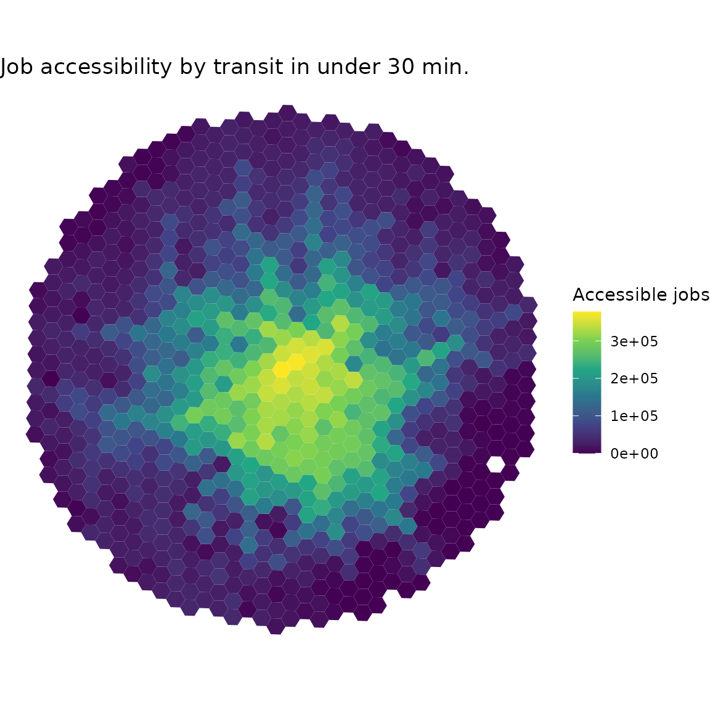

# Introduction to accessibility: calculating accessibility measures

**accessibility** is an R package that offers a set of fast and
convenient functions to calculate multiple transport accessibility
measures. Given a pre-computed travel cost matrix and a land use
dataset, the package allows one to calculate active and passive
accessibility levels using multiple accessibility metrics, such as
cumulative opportunities (using either a travel cost cutoff or a travel
cost interval), minimum travel cost to closest N number of activities,
gravitational measures and different floating catchment area methods.
This vignette briefly overviews the package with a few reproducible
examples.

## Installation

Before using **accessibility** please make sure that you have it
installed in your computer. You can download either the most stable
version from CRAN…

``` r
install.packages("accessibility")
```

…or the development version from GitHub.

``` r
# install.packages("remotes")
remotes::install_github("ipeaGIT/accessibility")
```

## Overview of the package

As of the time of writing this vignette, the **accessibility** package
includes five different functions to calculate accessibility:

1.  [`cost_to_closest()`](https://ipeagit.github.io/accessibility/dev/reference/cost_to_closest.md) -
    calculates the minimum travel cost to the closest *n* number of
    opportunities.
2.  [`cumulative_cutoff()`](https://ipeagit.github.io/accessibility/dev/reference/cumulative_cutoff.md) -
    calculates the frequently used threshold-based cumulative
    opportunities measure.
3.  [`cumulative_interval()`](https://ipeagit.github.io/accessibility/dev/reference/cumulative_interval.md) -
    calculates accessibility as the median/mean (or any other summary
    measure, really) number of opportunities that can be reached within
    a cost interval.
4.  [`gravity()`](https://ipeagit.github.io/accessibility/dev/reference/gravity.md) -
    calculates gravity-based accessibility, taking a decay function
    specified by the user (more on that in a few paragraphs).
5.  [`floating_catchment_area()`](https://ipeagit.github.io/accessibility/dev/reference/floating_catchment_area.md) -
    calculates accessibility taking into account the effects of
    competition for opportunities with different floating catchment area
    measures.

You may have noticed that we’ve mentioned a few times that the functions
calculate accessibility using travel *cost*, and not travel *time*.
That’s because we’re treating *costs* here in its generic sense:
anything that increases the impedance from an origin to a destination,
such as travel time, monetary costs, distances, risk perception, etc.,
can be considered a generic *cost*.

The
[`gravity()`](https://ipeagit.github.io/accessibility/dev/reference/gravity.md)
and
[`floating_catchment_area()`](https://ipeagit.github.io/accessibility/dev/reference/floating_catchment_area.md)
functions can use different decay functions when estimating
accessibility levels. These decay functions effectively weigh the number
of opportunities in a destination by a factor that depends on the travel
cost between the origin and the destination. For convenience, the
package currently includes the following decay functions:

1.  [`decay_binary()`](https://ipeagit.github.io/accessibility/dev/reference/decay_binary.md) -
    binary decay function (the one used in cumulative opportunities
    measures).
2.  [`decay_exponential()`](https://ipeagit.github.io/accessibility/dev/reference/decay_exponential.md) -
    negative exponential decay function.
3.  [`decay_linear()`](https://ipeagit.github.io/accessibility/dev/reference/decay_linear.md) -
    linear decay function (weights decay linearly from 1 to 0 until a
    specific travel cost cutoff is reached).
4.  [`decay_power()`](https://ipeagit.github.io/accessibility/dev/reference/decay_power.md) -
    inverse power decay function.
5.  [`decay_stepped()`](https://ipeagit.github.io/accessibility/dev/reference/decay_stepped.md) -
    stepped decay function (similar to
    [`decay_binary()`](https://ipeagit.github.io/accessibility/dev/reference/decay_binary.md),
    but can take an arbitrary number of steps, instead of a single one).

The users can also specify their own custom decay functions, if they
need to use functions currently not included in the package. For more
details on this, please read the [decay functions
vignette](https://ipeagit.github.io/accessibility/dev/articles/decay_functions.md).

## Demonstration on sample data

Enough talking. Let’s demonstrate some of the key features of the
package. First we’ll need to load the libraries we’ll be using:

``` r
library(accessibility)
library(data.table)
library(ggplot2)
library(sf)
```

### Data requirements

To use **accessibility**, you will need a pre-computed travel cost
matrix and some land use data (e.g. location of jobs, healthcare,
population, etc.). As mentioned before, travel costs can be presented in
terms of travel times, distances or monetary costs, for example. This
dataset must be structured in a `data.frame` containing, at least, the
columns `from_id`, `to_id` and the travel cost between each
origin-destination pair.

Your data should look similar to this sample dataset with public
transport travel times for the city of Belo Horizonte, Brazil, included
in the package for demonstration purposes[¹](#fn1).

``` r
data_dir <- system.file("extdata", package = "accessibility")

travel_matrix <- readRDS(file.path(data_dir, "travel_matrix.rds"))
head(travel_matrix)
#>            from_id           to_id travel_time
#>             <char>          <char>       <num>
#> 1: 89a88cdb57bffff 89a88cdb57bffff         5.8
#> 2: 89a88cdb57bffff 89a88cdb597ffff        47.0
#> 3: 89a88cdb57bffff 89a88cdb5b3ffff        48.0
#> 4: 89a88cdb57bffff 89a88cdb5cfffff        47.0
#> 5: 89a88cdb57bffff 89a88cd909bffff        64.0
#> 6: 89a88cdb57bffff 89a88cd90b7ffff        59.0
```

The land use data must also be structured in a `data.frame` and must
contain an `id` column, referring to the ids listed in the travel
matrix, and the number of opportunities/facilities/services in each
spatial unit. The sample dataset we’ll be using looks like this:

``` r
land_use_data <- readRDS(file.path(data_dir, "land_use_data.rds"))
head(land_use_data)
#>                 id population  jobs schools income_per_capita income_decile
#>             <char>      <int> <int>   <int>             <num>        <fctr>
#> 1: 89a881a5a2bffff        381   180       0           22369.1            10
#> 2: 89a881a5a2fffff        269   134       0            3205.1             9
#> 3: 89a881a5a67ffff        929   143       0           11394.0            10
#> 4: 89a881a5a6bffff        249    61       0            3659.8             9
#> 5: 89a881a5a6fffff        176    11       0            4905.1            10
#> 6: 89a881a5b03ffff        681  1071       0            2200.2             8
```

### Minimum travel cost

[`cost_to_closest()`](https://ipeagit.github.io/accessibility/dev/reference/cost_to_closest.md)
calculates the minimum travel cost to a given number of opportunities.
Much like the other functions we’ll be demonstrating in this section, it
takes as inputs the travel matrix and land use datasets, the name of the
column in the latter with the opportunities to be considered and the
name of the column in the former with the travel cost to be considered.
Additionally, it takes the minimum number of opportunities to be
considered. Here’s how calculating the time from each origin in Belo
Horizonte to the closest school looks like:

``` r
mtc <- cost_to_closest(
  travel_matrix,
  land_use_data,
  opportunity = "schools",
  travel_cost = "travel_time",
  n = 1
)
head(mtc)
#> Key: <id>
#>                 id travel_time
#>             <char>       <num>
#> 1: 89a881a5a2bffff          29
#> 2: 89a881a5a2fffff          24
#> 3: 89a881a5a67ffff          28
#> 4: 89a881a5a6bffff          33
#> 5: 89a881a5a6fffff          32
#> 6: 89a881a5b03ffff          17
```

### Cutoff-based cumulative opportunities

[`cumulative_cutoff()`](https://ipeagit.github.io/accessibility/dev/reference/cumulative_cutoff.md)
calculates the traditional cumulative opportunities measure, indicating
the number of opportunities that are accessible within a given travel
cost threshold. In this example, we estimate how many jobs can be
reached from each origin with trips taking up to 30 minutes of travel
time.

``` r
cum_cutoff <- cumulative_cutoff(
  travel_matrix,
  land_use_data,
  opportunity = "jobs",
  travel_cost = "travel_time",
  cutoff = 30
)
head(cum_cutoff)
#>                 id  jobs
#>             <char> <int>
#> 1: 89a881a5a2bffff 14561
#> 2: 89a881a5a2fffff 29452
#> 3: 89a881a5a67ffff 16647
#> 4: 89a881a5a6bffff 10700
#> 5: 89a881a5a6fffff  6669
#> 6: 89a881a5b03ffff 37029
```

Let’s say that we wanted to, instead, calculate *passive*
accessibility - i.e. by how many people each destination can be reached
within a given travel cost. Doing so requires very few changes to the
call: just change the “opportunity” column to `"population"` and set
`active` (`TRUE` by default) to `FALSE`.

``` r
passive_cum_cutoff <- cumulative_cutoff(
  travel_matrix,
  land_use_data,
  opportunity = "population",
  travel_cost = "travel_time",
  cutoff = 30,
  active = FALSE
)
head(passive_cum_cutoff)
#>                 id population
#>             <char>      <int>
#> 1: 89a881a5a2bffff      11053
#> 2: 89a881a5a2fffff      31903
#> 3: 89a881a5a67ffff      12488
#> 4: 89a881a5a6bffff      14474
#> 5: 89a881a5a6fffff      15053
#> 6: 89a881a5b03ffff      69582
```

The `active` parameter is available in most other accessibility
functions as well (with the exception of
[`floating_catchment_area()`](https://ipeagit.github.io/accessibility/dev/reference/floating_catchment_area.md)),
making it very easy to calculate both active and passive accessibility.

### Interval-based cumulative opportunities

`cumulative_time_interval()` calculates the interval-based cumulative
opportunities measure. This measure, developed by Tomasiello et al.
(2023), mitigates the impacts of arbitrary choices of cost cutoffs, one
of the main disadvantages of the traditional threshold-based cumulative
opportunities measure. Given a cost interval, it calculates several
accessibility estimates within the interval and summarizes it using a
user-specified function. In the example below, we calculate the average
number of accessible jobs considering multiple minute-by-minute time
thresholds between 40 and 60 minutes.

``` r
cum_interval <- cumulative_interval(
  travel_matrix = travel_matrix,
  land_use_data = land_use_data,
  opportunity = "jobs",
  travel_cost = "travel_time",
  interval = c(40, 60),
  summary_function = base::mean
)
head(cum_interval)
#>                 id   jobs
#>             <char>  <int>
#> 1: 89a88cdb57bffff 311965
#> 2: 89a88cdb597ffff 249416
#> 3: 89a88cdb5b3ffff 302515
#> 4: 89a88cdb5cfffff 373386
#> 5: 89a88cd909bffff 308429
#> 6: 89a88cd90b7ffff 344118
```

### Gravity measures

[`gravity()`](https://ipeagit.github.io/accessibility/dev/reference/gravity.md)
calculates gravity-based measures - i.e. measures in which the weight of
opportunities is gradually discounted as the travel cost increases. Of
course, several different decay functions can be used to so, each one of
them with a range of possible different parameters. In order to
accommodate such generalization, the function takes the decay function
to be used as a parameter.

In the example below, we calculate accessibility using a negative
exponential function with a `decay_value` (usually referred as the in
its formulation) of 0.2. Please see [the vignette on decay
functions](https://ipeagit.github.io/accessibility/dev/articles/decay_functions.md)
for more information on the decay functions shipped with the package and
how to use custom functions.

``` r
negative_exp <- gravity(
  travel_matrix,
  land_use_data,
  opportunity = "schools",
  travel_cost = "travel_time",
  decay_function = decay_exponential(decay_value = 0.2)
)
head(negative_exp)
#>                 id    schools
#>             <char>      <num>
#> 1: 89a88cdb57bffff 0.03041853
#> 2: 89a88cdb597ffff 1.15549493
#> 3: 89a88cdb5b3ffff 0.56519126
#> 4: 89a88cdb5cfffff 0.19852152
#> 5: 89a88cd909bffff 0.41378042
#> 6: 89a88cd90b7ffff 0.95737555
```

### Floating catchment area

[`floating_catchment_area()`](https://ipeagit.github.io/accessibility/dev/reference/floating_catchment_area.md)
calculates accessibility accounting for competition of resources using
different floating catchment area (FCA) methods. The FCA family includes
several different methods, which can be specified using the `method`
parameter. As of the time of writing this vignette, the package supports
two different methods:

- 2-Step Floating Catchment Area (`"2sfca"`) - the first metric in the
  FCA family, originally proposed by Luo and Wang (2003).
- Balanced Floating Catchment Area (`"bfca"`) - takes competition
  affects into account while correcting for issues of inflation of
  demand and service levels. Originally proposed by Paez, Higgins, and
  Vivona (2019) and named in Pereira et al. (2021).

Please note that, since FCA measures consider competition effects, we
have to specify which column in the land use dataset represents the
population competing for opportunities with the `demand` parameter. The
function also supports different decay functions. In the example below,
we calculate accessibility to jobs using the BFCA method, considering
that the entire population of the city compete for these jobs and using
a negative exponential decay function.

``` r
bfca <- floating_catchment_area(
  travel_matrix,
  land_use_data,
  opportunity = "jobs",
  travel_cost = "travel_time",
  demand = "population",
  method = "bfca",
  decay_function = decay_exponential(decay_value = 0.5)
)
head(bfca)
#>                 id       jobs
#>             <char>      <num>
#> 1: 89a88cdb57bffff 0.10280082
#> 2: 89a88cdb597ffff 0.30930287
#> 3: 89a88cdb5b3ffff 0.07288551
#> 4: 89a88cdb5cfffff 0.09759117
#> 5: 89a88cd909bffff 0.07390234
#> 6: 89a88cd90b7ffff 1.22525579
```

### Spatial availability

[`spatial_availability()`](https://ipeagit.github.io/accessibility/dev/reference/spatial_availability.md)
also calculates accessibility considering competition effects, though
using the spatial availability measure proposed by Soukhov et al.
(2023). The results from this metric are proportional both to the demand
in each origin and the travel cost it takes to reach the destinations.
As with the FCA function, we have to specify the column in the land use
dataset that contains the population competing for opportunities and we
can use different decay functions to calculate the impedance between
origin-destination pairs.

``` r
spatial_avlblt <- spatial_availability(
  travel_matrix,
  land_use_data,
  opportunity = "jobs",
  travel_cost = "travel_time",
  demand = "population",
  decay_function = decay_exponential(decay_value = 0.1)
)
head(spatial_avlblt)
#>                 id     jobs
#>             <char>    <num>
#> 1: 89a88cdb57bffff 186.0876
#> 2: 89a88cdb597ffff 140.0738
#> 3: 89a88cdb5b3ffff 736.5830
#> 4: 89a88cdb5cfffff 900.9284
#> 5: 89a88cd909bffff   0.0000
#> 6: 89a88cd90b7ffff 204.7962
```

### Balancing cost

[`balancing_cost()`](https://ipeagit.github.io/accessibility/dev/reference/balancing_cost.md)
calculates the balancing cost accessibility measure. Originally proposed
by Barboza et al. (2021) under the name “balancing time”, this metric is
defined as the travel cost required to reach as many opportunities as
the number of people in a given origin. Just like the previous two
functions,
[`balancing_cost()`](https://ipeagit.github.io/accessibility/dev/reference/balancing_cost.md)
also includes a parameter to specify the population competing for
opportunities.

The function also includes a `cost_increment` parameter, that should be
used to specify the increment that defines the travel cost distribution
from which the potential balancing costs will be picked. For example, an
increment of 1 (the default) tends to suit travel time distributions,
meaning that the function will first check if any origins reach their
balancing cost with a travel time of 0 minutes, then 1 minute, 2
minutes, 3, 4, …, etc. On the other hand, an increment of 1 might be too
big for a distribution of monetary costs, which could possibly benefit
from a smaller increment of 0.05 (5 cents), for example. Such increment
results in the function looking for balancing costs first at a monetary
cost of 0, then 0.05, 0.10, …, etc. In the example below, we use the
default cost increment of 1.

``` r
bal_cost <- balancing_cost(
  travel_matrix,
  land_use_data,
  opportunity = "jobs",
  travel_cost = "travel_time",
  demand = "population"
)
head(bal_cost)
#> Key: <id>
#>                 id travel_time
#>             <char>       <num>
#> 1: 89a881a5a2bffff          15
#> 2: 89a881a5a2fffff          13
#> 3: 89a881a5a67ffff          23
#> 4: 89a881a5a6bffff           7
#> 5: 89a881a5a6fffff          10
#> 6: 89a881a5b03ffff           6
```

### Visualize results

If you have the spatial data of your origins/destinations, you can
easily merge it with the accessibility to create spatial visualizations
of the results. The example below quickly shows how to create a simple
map using [ggplot2](https://ggplot2.tidyverse.org).

``` r
grid <- system.file("extdata/grid_bho.rds", package = "accessibility")
grid <- readRDS(grid)

spatial_data <- merge(grid, cum_cutoff, by = "id")

ggplot() +
  geom_sf(data = spatial_data, aes(fill = jobs), color = NA) +
  labs(
    title = "Job accessibility by transit in under 30 min.",
    fill = "Accessible jobs"
  ) +
  scale_fill_viridis_c() +
  theme_void()
```



## References

Barboza, Matheus H. C., Mariana S. Carneiro, Claudio Falavigna, Gregório
Luz, and Romulo Orrico. 2021. “Balancing Time: Using a New Accessibility
Measure in Rio de Janeiro.” *Journal of Transport Geography* 90
(January): 102924. <https://doi.org/10.1016/j.jtrangeo.2020.102924>.

Luo, Wei, and Fahui Wang. 2003. “Measures of Spatial Accessibility to
Health Care in a GIS Environment: Synthesis and a Case Study in the
Chicago Region.” *Environment and Planning B: Planning and Design* 30
(6): 865–84. <https://doi.org/10.1068/b29120>.

Paez, Antonio, Christopher D. Higgins, and Salvatore F. Vivona. 2019.
“Demand and Level of Service Inflation in Floating Catchment Area (FCA)
Methods.” Edited by Tayyab Ikram Shah. *PLOS ONE* 14 (6): e0218773.
<https://doi.org/10.1371/journal.pone.0218773>.

Pereira, Rafael H. M., Carlos Kauê Vieira Braga, Luciana Mendes Servo,
Bernardo Serra, Pedro Amaral, Nelson Gouveia, and Antonio Paez. 2021.
“Geographic Access to COVID-19 Healthcare in Brazil Using a Balanced
Float Catchment Area Approach.” *Social Science & Medicine* 273 (March):
113773. <https://doi.org/10.1016/j.socscimed.2021.113773>.

Soukhov, Anastasia, Antonio Páez, Christopher D. Higgins, and Moataz
Mohamed. 2023. “Introducing Spatial Availability, a Singly-Constrained
Measure of Competitive Accessibility.” Edited by Jun Yang. *PLOS ONE* 18
(1): e0278468. <https://doi.org/10.1371/journal.pone.0278468>.

Tomasiello, Diego Bogado, Daniel Herszenhut, João Lucas Albuquerque
Oliveira, Carlos Kaue Vieira Braga, and Rafael H. M. Pereira. 2023. “A
Time Interval Metric for Cumulative Opportunity Accessibility.” *Applied
Geography* 157 (August): 103007.
<https://doi.org/10.1016/j.apgeog.2023.103007>.

------------------------------------------------------------------------

1.  If you would like to calculate such travel cost matrices yourself,
    there are several computational packages to do that in R, such as
    [r5r](https://github.com/ipeaGIT/r5r),
    [dodgr](https://github.com/UrbanAnalyst/dodgr),
    [gtfsrouter](https://github.com/UrbanAnalyst/gtfsrouter),
    [hereR](https://github.com/munterfi/hereR) and
    [opentripplanner](https://github.com/ropensci/opentripplanner).
